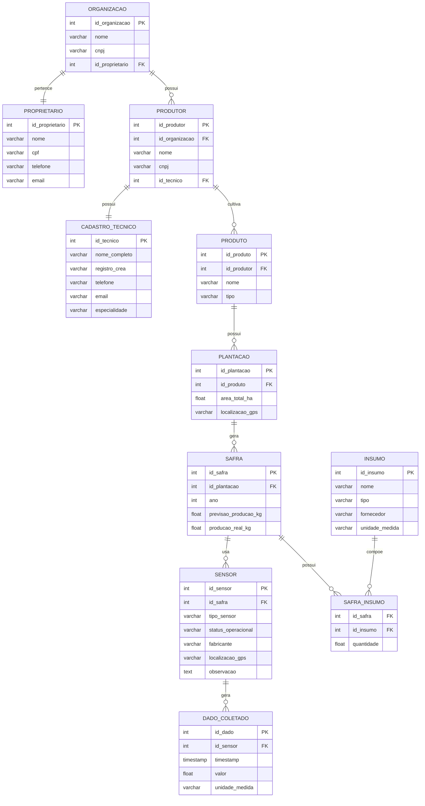

## Diagrama DER

```mermaid
erDiagram
    ORGANIZACAO ||--|| PROPRIETARIO : pertence
    ORGANIZACAO ||--o{ PRODUTOR : possui
    PRODUTOR ||--|| CADASTRO_TECNICO : possui
    PRODUTOR ||--o{ PRODUTO : cultiva
    PRODUTO ||--o{ PLANTACAO : possui
    PLANTACAO ||--o{ SAFRA : gera
    SAFRA ||--o{ SENSOR : usa
    SENSOR ||--o{ DADO_COLETADO : gera
    SAFRA ||--o{ SAFRA_INSUMO : possui
    INSUMO ||--o{ SAFRA_INSUMO : compoe

    ORGANIZACAO {
        int id_organizacao PK
        varchar nome
        varchar cnpj
        int id_proprietario FK
    }

    PROPRIETARIO {
        int id_proprietario PK
        varchar nome
        varchar cpf
        varchar telefone
        varchar email
    }

    PRODUTOR {
        int id_produtor PK
        int id_organizacao FK
        varchar nome
        varchar cnpj
        int id_tecnico FK
    }

    CADASTRO_TECNICO {
        int id_tecnico PK
        varchar nome_completo
        varchar registro_crea
        varchar telefone
        varchar email
        varchar especialidade
    }

    PRODUTO {
        int id_produto PK
        int id_produtor FK
        varchar nome
        varchar tipo
    }

    PLANTACAO {
        int id_plantacao PK
        int id_produto FK
        float area_total_ha
        varchar localizacao_gps
    }

    SAFRA {
        int id_safra PK
        int id_plantacao FK
        int ano
        float previsao_producao_kg
        float producao_real_kg
    }

    SENSOR {
        int id_sensor PK
        int id_safra FK
        varchar tipo_sensor
        varchar status_operacional
        varchar fabricante
        varchar localizacao_gps
        text observacao
    }

    DADO_COLETADO {
        int id_dado PK
        int id_sensor FK
        timestamp timestamp
        float valor
        varchar unidade_medida
    }

    INSUMO {
        int id_insumo PK
        varchar nome
        varchar tipo
        varchar fornecedor
        varchar unidade_medida
    }

    SAFRA_INSUMO {
        int id_safra FK
        int id_insumo FK
        float quantidade
    }
```