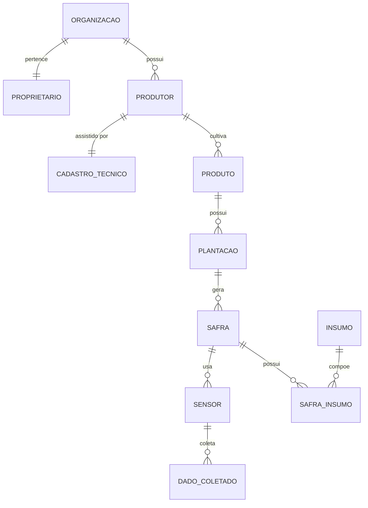

## Diagrama MER

```mermaid
erDiagram
    ORGANIZACAO ||--|| PROPRIETARIO : "pertence"
    ORGANIZACAO ||--o{ PRODUTOR : "possui"
    PRODUTOR ||--|| CADASTRO_TECNICO : "assistido por"
    PRODUTOR ||--o{ PRODUTO : "cultiva"
    PRODUTO ||--o{ PLANTACAO : "possui"
    PLANTACAO ||--o{ SAFRA : "gera"
    SAFRA ||--o{ SENSOR : "usa"
    SENSOR ||--o{ DADO_COLETADO : "coleta"
    SAFRA ||--o{ SAFRA_INSUMO : "possui"
    INSUMO ||--o{ SAFRA_INSUMO : "compoe"
```